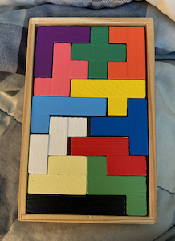
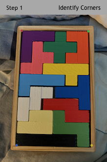
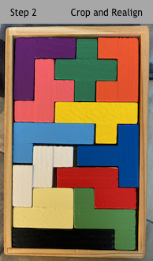
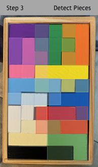
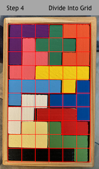
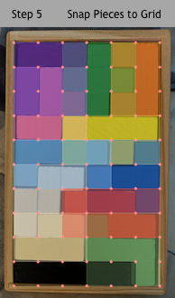

### Pento Pal

Below is a picture of the classic [6x10 pentomino puzzle](https://en.wikipedia.org/wiki/Polyomino). There are 12 different pieces, one for each way to connect 5 squares into one shape.

    

If you can believe it, there are 2,339 unique solutions to this puzzle! As one finds more and more of these solutions, it becomes difficult to track whether you've found a new solution or simply stumbled across a previously seen one.

Pento Pal is an app for tracking the solutions you've found and identifying if a new solution is actually new or just a repeat. It uses an ML pipeline to parse a picture of the puzzle into a description of the piece states. Specifically, the input is an image of a solved puzzle and the output is a 2-d array indicating which piece is present in each cell in the 6x10 puzzle grid.

Here's a brief look at how it works:

    
&nbsp; &nbsp; &nbsp; &nbsp;
  

    
&nbsp; &nbsp; &nbsp; &nbsp;
  
&nbsp; &nbsp; &nbsp; &nbsp;
  

